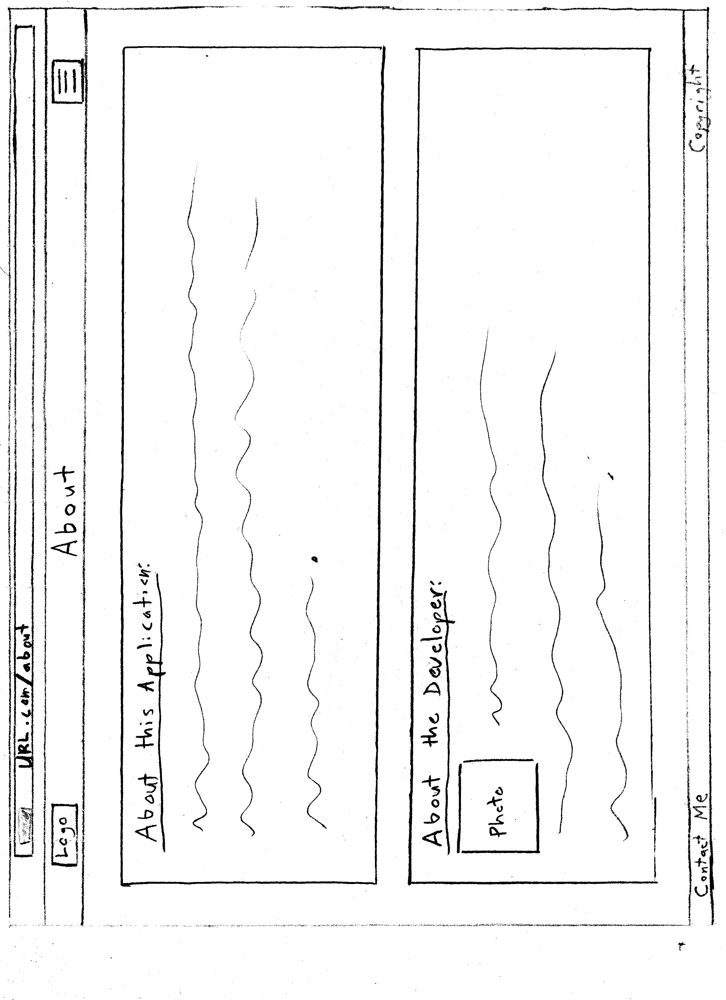

# DEFINITION STATEMENT
- I want to build an application to helps music producers organize iterations and track progress status for their various song sessions.

# DEFINE AUDIENCE
- This application is for music producers who have multiple song session files, and have a need to track different versions of the song sessions, and the ToDo task.

# DEFINE CONTENT
### What do you want your navigation to be?
- Landing page. Links to:
  - About
  - Song list page
- Song list page. Links to:
  - Home
  - About
  - Song details page
- Song details page. Links to:
  - Song List page
  - Home
  - About
- About. Links to:
  - Home
  - Song List page (or redirect to Home if no user has been selected yet in the web session)

### What do you want on each page?
- Landing page
  - landing page will have the capacity for selecting an existing  user or creating a new user.Once a user is selected or created, the user will be directed to their song session list page.
- Songs List Page
  - The user will be able to view, add, or delete songs from this list, or edit song session titlesThe user can sort songs sessions by title, date created, or date edited, and also search for titles.
Each individual song session title can be clicked to navigate to a Song Details page
- Song Version/Details Page
  - Lists info for each specific iteration, changes made for that iteration, and has a modal to access list of ToDo and Done tasks. The user will be able to view, create, edit, or delete iteration info and ToDo info.
- About page
  - User can view info about the inspiration for tha application and info about the developer.

### Font
- Barlow: https://fonts.google.com/specimen/Barlow/about?preview.text=TVT&query=barlow
- Noto: https://fonts.google.com/noto/specimen/Noto+Serif+Oriya?preview.text=Track%20Version%20Track

### Images
- Below is a screenshot showing an example of the unclear version mess that this app will alleviate. This will be used for the "What this app is" section of the home page.

- Once it is constructed, I will also have a screenshot of the app's ability to organize info and fix this problem. This will also be used for the "What this app is" section of the home page.

- Pic of me for the About page:

### Logo

### Color Palette
- #CBD4C2 - Ash Gray
- #FFFCFF - Snow
- #66635B - Dim Gray

### Text (verbiage/instructions)
- Home Page app description:
  -   Welcome to **Track Version Track**!With your song project file versions, have you ever had trouble tracking what changes were made in which versions of the song? Now you can turn this:
    (img of screenshot File Explorer showing organized files)
    Into this:
    (img of screenshot of app detail page)
- Home Page 'How it Works':
  - 1. Create your username/account. Enter titles of song projects for which you wish to track version history details, and any description of the song project.
    2.  Then click on any individual song project to enter your specific song version filenames. For each filename, enter a changelog (the description of changes that were made in that version).
    3. View the full version history and list of changes all in one place, and one page.
  This application also has the option of entering your ToDo list for the song project. Add items as they come up. Cross off items as they are completed, and they are saved into a Done List.

  That's it! You'll never again lose track of where changes were made!

- About page:
  - **About the inspiration for this application:**
  This application was inspired by version control in the software world. In the software development, version history is easy to track. With each change, developers add a small message that describes changes that were made. A list of all changes throughout a project can be viewed all in one place simultaneously. As a music producer, I thought wouldn't it be nice if we had something like this for song projects? In large projects, I would lose track of which iteration contained what changes. Sometimes I would need to go back to grab something from an old file to place into the current version. Without a system in place like offered with this application, I would find myself going through the lengthy process of opening and closing individual song version files throughout the history of the song until I (hopefully) could sort through things and find what I was looking for.
  - **About Me:**
  My name is John Puskas. In addition to being a music producer, I am also a full stack web developer. I have prior experience with C#/.NET and Python, and I have been learning to use JavaScriot as a full stack web development tool. This application represents my first foray into the world of full stack JS development.

# SITES RESEARCHED
- https://careerfoundry.com/en/blog/ux-design/5-key-principles-for-new-ux-designers/
Though the site is not at all directly related to my project topic, I took notice of the simplicity of the logo that they used and noted their use of nav bar. I will likely incorporate these 2 ideas.
- https://github.com
The whole idea of this project originated from the idea of version control implemented in software development. I like that the commit history for a repo can be viewed on a single page. I would like to have functionality in the capstone app that allows for this same type of listing for music projects. (with the caveat that it seems that the only way to achieve a list of version history for music session project files is for the user to manually enter new file version names and list the changes contained therein)
- https://rebelsguidetopm.com/how-to-do-document-version-control/
This site revealed to me that there aren’t really perfect options available for tracking even document files’ version history. The same may hold even more true for music session files.
- https://www.evernote.com/
There is only limited overlap on this site with what I want to accomplish, but I like the flexibility within the notes that can be created within their app. It would take a lot of time for a user to configure this site to perform the tasks that I have in mind for the capstone project, and even then there would be limitations since that is not what this site is particularly built for.
- https://trello.com/
Referenced for the purpose of getting more ideas for the ToDo’s aspect of the app that I will be building. The features for tracking tasks within a project are great in Trello, but I think that is beyond the scope of what I aim to build. The core functionality for what I am building is more for tracking past version history (as a changelog) of files rather than project management. I haven’t been able to find any web app that is geared specifically toward that purpose outside of the software development realm.
- https://releaseloop.com/
This site is geared toward record labels to plan a music release. Site access costs $149 with only a 7-day free trial, so I need to be careful about when/if I give it a full try. I viewed the site’s demo video. This site is for planning a music release rather than tracking versions of songs, though it looks like it could have features that could be twisted to make it sort of work for tracking version history.

# SWOT Analysis
- https://docs.google.com/document/d/1AixxuMTYxgqU1Roh-ISjo1V5MraC-eYR4MaL4T76HNM/edit?usp=sharing

# USER STORY MAP
- https://app.mural.co/t/sccapstone7433/m/sccapstone7433/1727813298264/486c36d097b443a3ef03d1c60fce05da922c76b2?sender=u98b61e27571bc454c97c6061

# USER FLOW DIAGRAM
- https://drive.google.com/file/d/1ufypD2t-LKbujWcOiOt9NHwN6ed3-JCr/view?usp=sharing

# WIREFRAMES
## Computer
#### Home Page

#### Songs Page

####  Song Versions Page

####  ToDo's Modal for Song Versions Page

####  About Page

## Mobile
####  Home Page

####  Songs Page

####  Song Versions Page

####  ToDo's Modal for Song Versions Page

####  About Page

